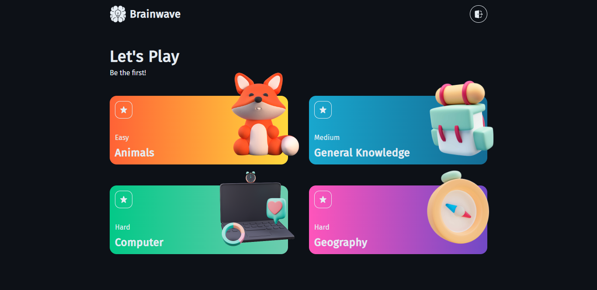

# Brainwave

[](https://brainwave-beta.netlify.app/)

## Developing

Node.js `>= 16.x` setup with [yarn](https://yarnpkg.com/) is recommended.

```bash
# duplicate & fill environment file
cp .env.example

# install dependencies
yarn

# serve with hot reload at localhost:3000
yarn start

# build for production
yarn build
```

## Built with

- Framework - [**ReactJS**](https://reactjs.org/)
- Styling - [**Chakra UI**](https://chakra-ui.com/)
- Fonts - [**Font Source**](https://fontsource.org/)
- Vite - [**Module Bundler**](https://vitejs.dev/)
- Husky - [**Git Hook**](https://typicode.github.io/husky/#/)
- Icons - [**ChakraIcons**](https://chakra-ui.com/docs/components/icon/usage)
- Data Fetching - [**Axios**](https://axios-http.com/)
- State Management - [**Zustand**](https://zustand-demo.pmnd.rs/)
- Cliend Side Routing - [**ReactRouterDOM**](https://reactrouter.com/)
- User Authentication - [**Firebase**](https://firebase.google.com/)
- Package Manager - [**Yarn**](https://yarnpkg.com/)
- Linter - [**Eslint**](https://eslint.org/)
- Code Formatter - [**Prettier**](https://prettier.io/)
- Deployment - [**Netlify**](https://www.netlify.com/)
- Others
  - Encode HTML Entities - [**html-entities**](https://github.com/mdevils/html-entities)
  - Lint Staged - [**lint-staged**](https://www.npmjs.com/package/lint-staged)
