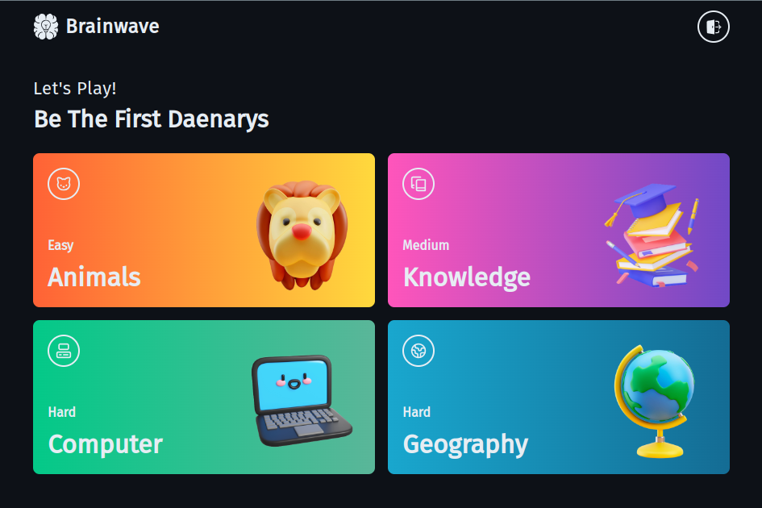

# Brainwave

[](https://brainwave-beta.netlify.app/)

Discover Brain Wave, your portal to diverse knowledge. Engage in four distinct quiz categories, each a gateway to a unique world of discovery. From general wisdom to niche topics, explore, learn, and excel in categories tailored to fascinate every inquisitive mind.

## Developing

Node.js `>= 18.x` setup with [yarn](https://yarnpkg.com/) is recommended.

```bash
# duplicate & fill environment file
cp .env.example

# install dependencies
yarn

# serve with hot reload at localhost:3000
yarn start

# build for production
yarn build
```

## Built with

- UI Framework - [**ReactJS**](https://reactjs.org/)
- Styling - [**Chakra UI**](https://chakra-ui.com/)
- Fonts - [**Font Source**](https://fontsource.org/)
- Vite - [**Module Bundler**](https://vitejs.dev/)
- Icons - [**ChakraIcons**](https://chakra-ui.com/docs/components/icon/usage)
- HTTP Client - [**Axios**](https://axios-http.com/)
- State Management - [**Zustand**](https://zustand-demo.pmnd.rs/)
- Cliend Side Routing - [**ReactRouterDOM**](https://reactrouter.com/)
- Authentication - [**Firebase**](https://firebase.google.com/)
- Package Manager - [**Yarn**](https://yarnpkg.com/)
- Deployment - [**Netlify**](https://www.netlify.com/)

## License

This project is licensed under the MIT License - see the [LICENSE.md](LICENSE) file for details.
